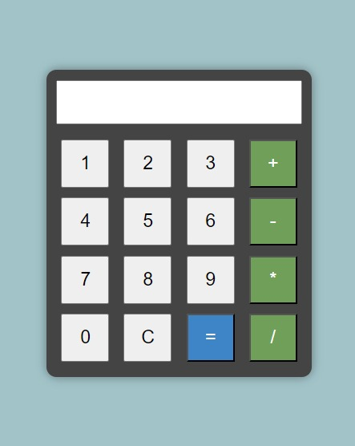

# Simple Calculator

A basic calculator web application built with HTML, CSS, and JavaScript. This project provides a user-friendly interface for performing arithmetic operations.

## Features

- Addition, subtraction, multiplication, and division operations.
- Responsive design for a better user experience on various devices.
- Error handling for invalid input and mathematical operations.
  
## Live Demo

Check out the live demo: [Simple_Calculator](https://simple-calculator-vert-omega.vercel.app/)

## How to Use

1. Open the `index.html` file in your web browser.
2. Use the numeric buttons to input numbers.
3. Use the operator buttons (`+`, `-`, `*`, `/`) to perform operations.
4. Press the `C` button to clear the display.
5. Press the `=` button to calculate the result.

## Preview

## Technologies Used

- HTML
- CSS
- JavaScript

## Contributing

Contributions are welcome! If you find any issues or have suggestions for improvements, feel free to create an issue or submit a pull request.

## License

This project is licensed under the [MIT License](LICENSE).

